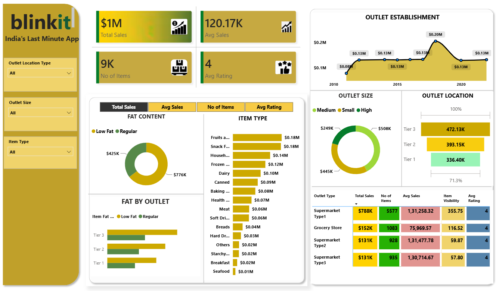

# 🛒 Blinkit Grocery Sales Analysis Dashboard

## 📌 Project Overview

This project is a **Blinkit Grocery Sales Analysis Dashboard** developed using **Microsoft Power BI**.

The objective of this project is to analyze grocery sales data and identify meaningful business insights related to **sales performance, product categories, outlet types, outlet sizes, outlet locations, product visibility, and customer ratings**.

The raw dataset was prepared and transformed before creating an interactive Power BI dashboard for business analysis and reporting.

---

## 🎯 Project Objectives

The main objectives of this project are:

* Analyze overall grocery sales performance.
* Identify top-performing product categories.
* Compare sales across different outlet types.
* Analyze sales based on outlet size and location.
* Understand product visibility and its relationship with sales.
* Analyze customer ratings.
* Study sales trends based on outlet establishment year.
* Compare sales between different fat-content categories.
* Create an interactive dashboard for business decision-making.

---

## 📂 Dataset

The project uses a Blinkit grocery sales dataset containing information about products, outlets, sales, visibility, and ratings.

### Important Columns

* `Item Identifier`
* `Item Weight`
* `Item Fat Content`
* `Item Visibility`
* `Item Type`
* `Item MRP`
* `Outlet Identifier`
* `Outlet Establishment Year`
* `Outlet Size`
* `Outlet Location Type`
* `Outlet Type`
* `Item Outlet Sales`
* `Rating`

The original Excel dataset is included in this repository.

---

## 🧹 Data Cleaning & Transformation

The data was prepared before visualization using **Power Query**.

The main steps included:

* Handling missing values
* Checking duplicate records
* Correcting data types
* Standardizing categorical values
* Cleaning inconsistent values
* Transforming columns where required
* Preparing the dataset for Power BI analysis

---

## 🛠️ Tools & Technologies

| Tool / Technology      | Purpose                              |
| ---------------------- | ------------------------------------ |
| **Microsoft Excel**    | Dataset and data inspection          |
| **Power BI**           | Dashboard creation and visualization |
| **Power Query**        | Data cleaning and transformation     |
| **DAX**                | Measures and calculations            |
| **Data Visualization** | Business insights and reporting      |

---

## 📊 Dashboard KPIs

The dashboard tracks the following key performance indicators:

| KPI                    | Description               |
| ---------------------- | ------------------------- |
| 💰 **Total Sales**     | Overall sales generated   |
| 📦 **Number of Items** | Total number of items     |
| 💵 **Average Sales**   | Average sales performance |
| ⭐ **Average Rating**   | Average customer rating   |

> KPI values are displayed directly in the Power BI dashboard.

---

## 📈 Dashboard Features

### 1. Sales Analysis

Provides an overview of overall grocery sales performance.

### 2. Item Type Analysis

Analyzes sales across different grocery categories such as:

* Fruits & Vegetables
* Snack Foods
* Household
* Frozen Foods
* Dairy
* Canned
* Baking Goods
* Health & Hygiene
* Meat
* Soft Drinks
* Others

### 3. Fat Content Analysis

Compares sales between:

* **Low Fat**
* **Regular**

### 4. Outlet Type Analysis

Compares sales performance across different outlet types, including:

* Supermarket Type 1
* Supermarket Type 2
* Supermarket Type 3
* Grocery Store

### 5. Outlet Size Analysis

Analyzes sales according to outlet size:

* Small
* Medium
* High

### 6. Outlet Location Analysis

Compares performance across:

* Tier 1
* Tier 2
* Tier 3

### 7. Outlet Establishment Analysis

Analyzes sales performance based on the outlet establishment year.

### 8. Customer Rating Analysis

Examines average customer ratings and their relationship with sales performance.

---

## 🎛️ Interactive Dashboard

The dashboard allows users to interact with the data using filters/slicers such as:

* Outlet Location Type
* Outlet Size
* Item Type

These filters allow users to explore different business segments dynamically.

---

## 📷 Dashboard Preview

The dashboard provides a single-page view of Blinkit's grocery sales performance.



---

## 🎥 Dashboard Demo

A demonstration video of the Power BI dashboard is included in the repository.

**File:** `blinkit.mp4`

The video demonstrates the dashboard layout, visualizations, KPIs, and interactive analysis.

---

## 🔄 Project Workflow

```text
Raw Excel Dataset
        ↓
Data Import
        ↓
Data Cleaning
        ↓
Power Query Transformation
        ↓
Data Modeling
        ↓
DAX Measures
        ↓
Data Visualization
        ↓
Power BI Dashboard
        ↓
Business Insights
```

---

## 💡 Business Questions

This dashboard helps answer questions such as:

* Which product categories generate the highest sales?
* Which outlet type performs best?
* Which outlet location generates the highest sales?
* Does outlet size affect sales performance?
* Which fat-content category contributes more to sales?
* How does product visibility relate to sales?
* Which products/categories have better ratings?
* How does sales performance vary by outlet establishment year?

---

## 📌 Key Insights

The dashboard can be used to identify:

* Top-performing product categories.
* High-performing outlet types.
* Sales contribution by outlet size.
* Sales performance across different outlet locations.
* Differences between Low Fat and Regular products.
* Sales trends across outlet establishment years.
* Customer rating patterns.

> **Note:** The exact numerical insights should be taken from the current Power BI dashboard rather than manually entered in the README.

---

## 📁 Project Structure

```text
BLINKIT-GROCERY-DATA/
│
├── BlinkIT Grocery Data Excel.xlsx
├── DASHBOARD.png
├── blinkit.mp4
└── README.md
```

---

## 🎓 Skills Demonstrated

This project demonstrates practical skills in:

* Data Analytics
* Data Cleaning
* Data Transformation
* Microsoft Excel
* Power BI
* Power Query
* DAX
* Data Visualization
* KPI Development
* Business Intelligence
* Dashboard Design
* Business Insights

---

## 👩‍💻 Author

### Saziya Alvi

**Aspiring Data Analyst**

**Skills:**
SQL | Python | Excel | Power BI | DAX | Data Analytics | Machine Learning

This project is part of my Data Analytics portfolio and demonstrates my ability to transform raw data into meaningful business insights using data visualization and business intelligence tools.

---

## ⭐ Project

If you found this project useful, consider giving the repository a ⭐ star.
